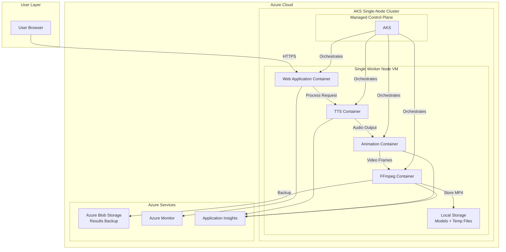
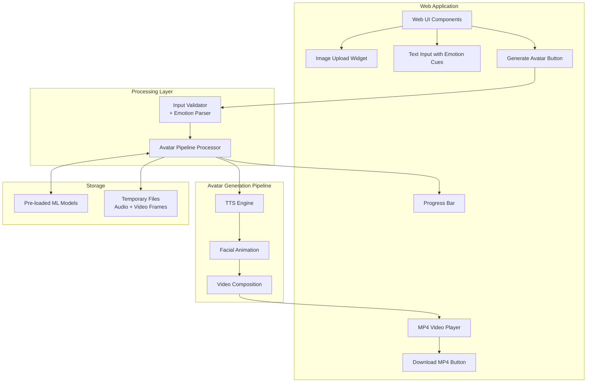
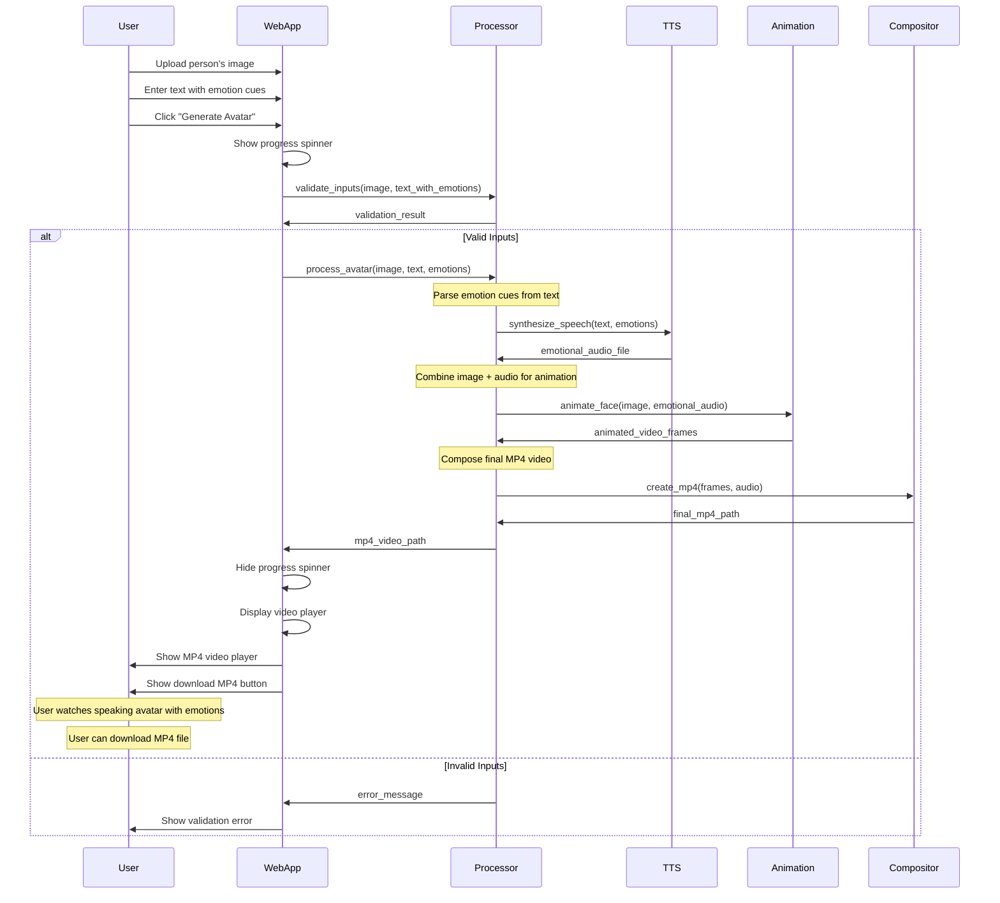

# Architecture

## Infrastructure

```mermaid
graph TB
    subgraph "User Layer"
        U[User Browser]
    end
    
    subgraph "Azure Cloud"
        subgraph "AKS Single-Node Cluster"
            subgraph "Managed Control Plane"
                K8S[AKS]
            end
            
            subgraph "Single Worker Node VM"
                WEBPOD[Web Application Container]
                TTSPOD[TTS Container]
                ANIMPOD[Animation Container]
                FFMPEGPOD[FFmpeg Container]
                STORAGE[Local Storage<br/>Models + Temp Files]
            end
        end
        
        subgraph "Azure Services"
            BLOB[Azure Blob Storage<br/>Results Backup]
            MON[Azure Monitor]
            LOG[Application Insights]
        end
    end
    
    U -->|HTTPS| WEBPOD
    
    WEBPOD -->|Process Request| TTSPOD
    TTSPOD -->|Audio Output| ANIMPOD
    ANIMPOD -->|Video Frames| FFMPEGPOD
    FFMPEGPOD -->|Store MP4| STORAGE
    FFMPEGPOD -->|Backup| BLOB
    
    K8S -->|Orchestrates| WEBPOD
    K8S -->|Orchestrates| TTSPOD
    K8S -->|Orchestrates| ANIMPOD
    K8S -->|Orchestrates| FFMPEGPOD
    
    WEBPOD --> MON
    TTSPOD --> LOG
    ANIMPOD --> LOG
    FFMPEGPOD --> LOG
```

## Application

```mermaid
graph TB
    subgraph "Web Application"
        UI[Web UI Components]
        UPLOAD[Image Upload Widget]
        TEXT[Text Input with Emotion Cues]
        BUTTON[Generate Avatar Button]
        PROGRESS[Progress Bar]
        VIDEO[MP4 Video Player]
        DOWNLOAD[Download MP4 Button]
    end
    
    subgraph "Processing Layer"
        VALIDATOR[Input Validator<br/>+ Emotion Parser]
        PROCESSOR[Avatar Pipeline Processor]
    end
    
    subgraph "Avatar Generation Pipeline"
        TTS[TTS Engine]
        ANIM[Facial Animation]
        COMP[Video Composition]
    end
    
    subgraph "Storage"
        MODELS[Pre-loaded ML Models]
        TEMP[Temporary Files<br/>Audio + Video Frames]
    end
    
    UI --> UPLOAD
    UI --> TEXT
    UI --> BUTTON
    
    BUTTON --> VALIDATOR
    VALIDATOR --> PROCESSOR
    PROCESSOR --> PROGRESS
    
    PROCESSOR --> TTS
    TTS --> ANIM
    ANIM --> COMP
    COMP --> VIDEO
    
    PROCESSOR <--> MODELS
    PROCESSOR --> TEMP
    VIDEO --> DOWNLOAD
```

## Flow

```mermaid
sequenceDiagram
    participant User
    participant WebApp
    participant Processor
    participant TTS
    participant Animation
    participant Compositor
    
    User->>WebApp: Upload person's image
    User->>WebApp: Enter text with emotion cues
    User->>WebApp: Click "Generate Avatar"
    
    WebApp->>WebApp: Show progress spinner
    WebApp->>Processor: validate_inputs(image, text_with_emotions)
    Processor->>WebApp: validation_result
    
    alt Valid Inputs
        WebApp->>Processor: process_avatar(image, text, emotions)
        
        Note over Processor: Parse emotion cues from text
        Processor->>TTS: synthesize_speech(text, emotions)
        TTS->>Processor: emotional_audio_file
        
        Note over Processor: Combine image + audio for animation
        Processor->>Animation: animate_face(image, emotional_audio)
        Animation->>Processor: animated_video_frames
        
        Note over Processor: Compose final MP4 video
        Processor->>Compositor: create_mp4(frames, audio)
        Compositor->>Processor: final_mp4_path
        
        Processor->>WebApp: mp4_video_path
        WebApp->>WebApp: Hide progress spinner
        WebApp->>WebApp: Display video player
        WebApp->>User: Show MP4 video player
        WebApp->>User: Show download MP4 button
        
        Note over User: User watches speaking avatar with emotions
        Note over User: User can download MP4 file
    else Invalid Inputs
        Processor->>WebApp: error_message
        WebApp->>User: Show validation error
    end
```
