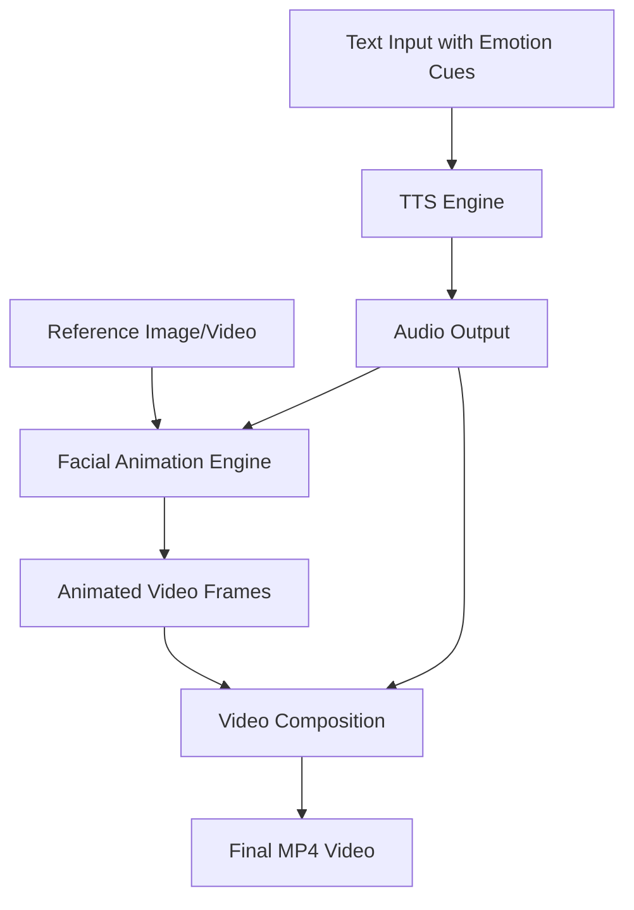

# POC

## Summary

Phase 1 focuses on building a modular, real-time avatar rendering pipeline using open-source components. The system transforms
static English text into animated speaking avatars by taking a reference image/video of a real person and making them appear to
speak the input text.

Key Objectives:

- Create realistic talking avatars from real person photos/videos with emotion expression
- Support explicit emotion cues to control voice tone and facial expressions
- Deploy as web-accessible service with reasonable response times
- Use open-source components for maximum flexibility and cost control
- Support multiple quality/performance tiers based on use case requirements

## Pipeline

Pipeline Stages:

- Text Processing: Convert input text with emotion cues to natural-sounding expressive speech
- Facial Animation: Animate reference image/video to match speech audio and express emotions
- Video Generation: Combine animated visuals with emotional audio into final MP4 video output

Input Requirements:

- Text: Plain text with emotion cues (length TBD based on TTS engine limits and user testing)
- Emotion Support: Explicit emotion markers (e.g., [happy], [sad], [excited], [angry], [surprised]) to control voice tone and
  facial expressions
- Reference Media: Photo or short video of person's face (high quality preferred)
- Optional: Voice selection, animation style preferences, emotion intensity levels

Emotion Cue Examples:

- "Hello [happy] everyone! I'm [excited] to share this news with you."
- "I'm [sad] to inform you that [serious] we need to postpone the meeting."
- "[Surprised] Wow! That's [amazed] absolutely incredible!"

## Web Application

### Overview

A simple web interface where users upload a person's photo/video, input text, and receive a video of that person appearing to
speak the text. For rapid POC development, we'll use lightweight Python web frameworks.

User Flow:

- User uploads reference image/video of a person (or selects from presets)
- User enters text with optional emotion cues in web form (character limit to be determined)
- User can specify emotions using tags like [happy], [sad], [angry], [surprised]
- System processes request through pipeline (processing time varies by configuration - requires benchmarking)
- User receives downloadable MP4 video of person speaking the text

Key Requirements:

- Response Time: To be benchmarked based on actual hardware and configuration testing
- Quality: Clear speech with synchronized facial animation
- Accessibility: Web-based, no client installation required
- Rapid Development: Quick iteration and deployment for POC validation

### Parameters to be Determined Through Testing

Text Input Limits:

- Character Limit: Need to test TTS engine limits and optimal user experience
- Emotion Cue Processing: Test parsing and application of emotion markers
- Processing Time vs Text Length: Benchmark relationship between input size and processing time
- Speech Duration: Measure actual speech output duration for different text lengths with emotions

Processing Performance:

- Hardware Benchmarks: Test actual processing times on different Azure VM configurations
- Configuration Comparison: Measure speed differences between lightweight, balanced, and high-quality setups
- Scalability Limits: Determine concurrent user capacity

Quality vs Speed:

- User Acceptance Testing: Determine minimum acceptable quality levels
- Processing Time Tolerance: Test user patience limits for different use cases
- Output Video Length: Optimal duration for different applications

### Web Framework Options

#### Streamlit

- Strengths: Extremely simple Python-only development, built-in file upload/download, automatic UI generation
- Implementation: ~50-100 lines of code for complete interface
- Deployment: Single command deployment to Streamlit Cloud or any server
- Best For: Data science teams, rapid prototyping, internal demos

#### Gradio

- Strengths: ML-focused interface components, automatic API generation, easy sharing
- Implementation: ~30-50 lines of code with pre-built ML components
- Deployment: Built-in sharing links, HuggingFace Spaces integration
- Best For: ML model demos, public sharing, research presentations

#### Reflex

- Strengths: Full-stack Python, React-like components, real-time updates
- Implementation: ~100-200 lines of code with more customization
- Deployment: Built-in deployment tools, better scalability than Streamlit
- Best For: Production-ready apps, custom UI requirements, Python teams

## Analysis

### TTS Engine

#### Coqui XTTS v2

- Algorithm: GPT-based transformer with HiFi-GAN vocoder, trained on 75+ language datasets
- Languages: 17 main languages, Greek requires custom training
- Voice Cloning: Excellent - clones any voice from 6+ seconds of reference audio, no training needed
- Technical Specs: 1.87GB model, 4-8GB VRAM for inference, 12-16GB for training
- Performance: Real-time on GPU (0.17x RTX 4090), 10-20x slower on CPU
- Integration: Production-ready with REST API, Docker, streaming support
- Emotion Control: Limited - only through reference audio characteristics, no explicit tags
- Greek Support: Possible with 10-20 hours of data, 2-5 days training time
- Strengths: Best voice cloning quality, production-ready, cross-lingual synthesis
- Weaknesses: Large model, high GPU requirements, no pre-trained Greek, limited emotion control
- Best For: High-quality voice cloning, production deployments requiring voice consistency

#### ESPnet

- Algorithm: Modular framework supporting multiple architectures (Transformer, FastSpeech2, VITS, Tacotron2)
- Languages: 100+ languages including pre-trained Greek models with good quality
- Voice Cloning: Limited - requires training, not zero-shot
- Technical Specs: 50-500MB models, 2-4GB VRAM inference, 8-16GB training
- Performance: Real-time on CPU (FastSpeech2), excellent CPU optimization
- Integration: Requires custom API wrapper, Docker available, extensive CLI tools
- Emotion Control: Good prosody control, style tokens, GST support in some models
- Greek Support: Pre-trained models available, training recipes provided
- Strengths: Excellent Greek support, modular architecture, academic backing, CPU-friendly
- Weaknesses: Complex setup, requires ML expertise, limited production APIs
- Best For: Greek TTS, research applications, custom model development, CPU deployments

#### Piper TTS

- Algorithm: VITS architecture with conditional VAE, direct text-to-waveform synthesis
- Languages: 40+ languages with multiple pre-trained Greek voices (male/female options)
- Voice Cloning: None - uses pre-trained single-speaker models only
- Technical Specs: 10-50MB per model, CPU-only (no GPU needed), <100MB RAM
- Performance: 2-5x faster than real-time on CPU, runs on Raspberry Pi
- Integration: Simple installation, CLI, Python API, Docker
- Emotion Control: Very limited - mainly through punctuation and speed adjustment
- Greek Support: Multiple pre-trained Greek voices ready to use, no training needed
- Strengths: Excellent Greek support, extremely lightweight, CPU-only, very fast, simple deployment
- Weaknesses: No voice cloning, limited emotion control, single-speaker models only
- Best For: Greek TTS, resource-constrained environments, edge computing, CPU-only deployments

### Facial Animation

#### SadTalker

- Algorithm: 3D Morphable Model + neural rendering, trained on VoxCeleb/CelebA face datasets
- Input/Output: Single photo → realistic video with natural expressions and head movement
- Technical Specs: 8-12GB VRAM required, ~5-10 seconds processing per second of output
- Quality: State-of-the-art facial animation with natural expressions and pose
- Emotion Support: Excellent - advanced facial expressions, natural head movements, emotion-driven animations
- Integration: Python library, Gradio interface, Docker support
- Strengths: Best quality facial animation, single image input, excellent emotion expression
- Weaknesses: High GPU requirements, slow processing, complex setup
- Best For: High-quality expressive animation requiring natural emotions and head movement

#### Wav2Lip

- Algorithm: GAN with U-Net generator + SyncNet discriminator, trained on LRS2/LRS3 lip-reading datasets
- Input/Output: Photo/video → accurate lip-sync video preserving facial identity
- Technical Specs: 4-6GB VRAM required, faster inference than SadTalker
- Quality: Good lip-sync accuracy, preserves original facial features
- Emotion Support: Minimal - only lip movement intensity, no facial expressions
- Integration: Python scripts, command-line interface, requires manual setup
- Strengths: Fast inference, good lip-sync, lower GPU requirements, stable results
- Weaknesses: Lip movement only, no head pose changes, potential artifacts
- Best For: Basic lip-sync applications where speed is more important than expression

### Video Rendering

#### FFmpeg

- Algorithm: Rule-based signal processing with H.264/H.265 codec compression
- Input/Output: Audio + image sequences/video → final MP4 video file
- Technical Specs: CPU/GPU encoding, configurable quality settings, minimal memory overhead
- Performance: Real-time encoding possible, hardware acceleration support (NVENC, QuickSync)
- Integration: Command-line interface, Python bindings (ffmpeg-python), Docker containers
- Format Support: Universal compatibility, optimized for web delivery (MP4/H.264)
- Strengths: Battle-tested, extensive format support, hardware acceleration, production-ready
- Weaknesses: Command-line complexity, requires parameter tuning for optimal quality
- Best For: Production-quality video generation, server-side processing, web delivery

## Configurations

### Configuration A: Premium Quality with Full Emotions

- Components: Coqui XTTS v2 + SadTalker + FFmpeg
- Input: Single photo of real person + text with emotion cues
- Output: Premium quality MP4 with natural expressions, head movement, and voice cloning
- Technical Requirements:
  - GPU: 12-16GB VRAM (XTTS: 4-8GB + SadTalker: 8-12GB)
  - Processing Speed: ~5-10 seconds per second of output video
  - Model Size: ~2GB total (XTTS: 1.87GB + SadTalker models)
- Capabilities:
  - Voice Cloning: Clone any voice from 6+ seconds of reference audio
  - Emotion Expression: Advanced facial expressions and natural head movements
  - Quality: State-of-the-art realism in both voice and animation
- Limitations:
  - Greek Language: Requires custom training (2-5 days)
  - Emotion Control: Limited to reference audio characteristics
  - Resource Intensive: High GPU requirements and slow processing
- Best For: Premium applications requiring maximum realism and custom voice cloning

### Configuration B: Balanced Quality with Greek Support

- Components: ESPnet + Wav2Lip + FFmpeg
- Input: Photo of real person + text (Greek language supported)
- Output: Good quality MP4 with accurate lip-sync and Greek TTS
- Technical Requirements:
  - GPU: 4-6GB VRAM (ESPnet: 2-4GB + Wav2Lip: 4-6GB)
  - Processing Speed: Faster than Configuration A
  - Model Size: 50-500MB (much smaller than Configuration A)
- Capabilities:
  - Greek Language: Pre-trained Greek models available
  - Lip-Sync: Good accuracy preserving facial identity
  - Emotion Control: Some prosody control and style tokens
- Limitations:
  - No Voice Cloning: Uses pre-trained voices only
  - Limited Animation: Lip movement only, no head pose changes
  - Complex Setup: Requires ML expertise and custom API wrapper
- Best For: Greek language applications, production web apps with good quality requirements

### Configuration C: Lightweight CPU-Only

- Components: Piper TTS + Wav2Lip + FFmpeg
- Input: Photo of real person + text (multiple Greek voices available)
- Output: Basic quality lip-sync and Greek TTS
- Technical Requirements: MP4 with
  - GPU: None required (CPU-only processing)
  - Processing Speed: Slower than GPU but acceptable for basic needs
  - Model Size: 10-50MB (Piper) + Wav2Lip models
- Capabilities:
  - Greek Language: Multiple pre-trained Greek voices (male/female)
  - Photo Animation: Can animate real person photos
  - Resource Efficient: No GPU required, moderate CPU usage
- Limitations:
  - Slow Processing: CPU-only Wav2Lip is significantly slower
  - No Voice Cloning: Fixed pre-trained voices only
  - Basic Animation: Lip movement only, no head pose or expressions
  - Quality Trade-off: Lower quality due to CPU processing
- Best For: Resource-constrained environments, instant Greek TTS, CPU-only deployments

### Trade-offs

#### Quality vs Performance vs Language Support

| Configuration | Quality | Speed | Greek Support | Voice Cloning | GPU Required |
|---------------|---------|-------|---------------|---------------|--------------|
| A (Premium) | ✅ Highest | ❌ Slowest | ❌ Training needed | ✅ Excellent | 12-16GB |
| B (Balanced) | ✅ Good | ✅ Fast | ✅ Pre-trained | ❌ None | 4-6GB |
| C (Lightweight) | ❌ Basic | ⚠️ Slow (CPU) | ✅ Multiple voices | ❌ None | None |

#### Cost vs Capability

- Configuration A: Highest cost, maximum capability, custom voice cloning
- Configuration B: Moderate cost, good quality, immediate Greek support
- Configuration C: Lowest cost, basic photo animation, CPU-only deployment

#### Use Case Recommendations

- Premium Applications: Configuration A for maximum realism and voice cloning
- Greek Language Priority: Configuration B for immediate Greek support with good quality
- Resource Constraints: Configuration C for CPU-only deployment and instant Greek TTS
- Production Web Apps: Configuration B recommended as starting point

#### Technical Considerations

- Real Person Photos: All configurations support photo input
- Emotion Expression: Only Configuration A provides natural facial expressions
- Greek Language: Configurations B & C have immediate Greek support
- Voice Consistency: Only Configuration A allows custom voice cloning
- Integration Complexity: Configuration A (complex), Configuration B (moderate), Configuration C (simple)
- Deployment Options: A & B require GPU infrastructure, C runs on any CPU

## Infrastructure

Main infrustructure:

- Setup: Managed Kubernetes with one worker node
- Cost: AKS fee + single VM cost
- Benefits: Managed control plane, easy scaling, Azure integration
- Best For: POC with production path, managed infrastructure

Microservices on Single VM:

- Web Application Container: Streamlit/Gradio/Reflex interface, handles user requests
- TTS Container: Text-to-speech processing (XTTS v2/ESPnet/Piper)
- Animation Container: Facial animation (SadTalker/Wav2Lip)
- FFmpeg Container: Video composition and MP4 generation
- Shared Storage: Models and temporary files on VM disk

### Azure VM Specifications

| Configuration | Azure VM Type | GPU | RAM | Storage | Monthly Cost  |
|---------------|---------------|-----|-----|---------|---------------|
| A (Premium) | Standard_NC12s_v3 | 12GB Tesla V100 | 112GB | 680GB SSD | ~€1,200 |
| B (Balanced) | Standard_NV6 | 8GB Tesla M60 | 56GB | 340GB SSD | ~€600 |
| C (Lightweight) | Standard_D8s_v3 | None | 32GB | 64GB SSD | ~€300 |

### Azure Services Integration

Core Services:

- Azure Kubernetes Service (AKS): Managed Kubernetes control plane
- Azure Virtual Machines: GPU/CPU compute resources
- Azure Blob Storage: Model storage and result backup

Optional Services:

- Azure Monitor: Performance tracking and alerts
- Application Insights: Request tracing and error monitoring
- Azure Container Registry: Container image storage
- Azure Key Vault: Secrets and configuration management

### Security & Compliance

Network Security:

- Private AKS cluster with no public IPs
- Network Security Groups (NSGs) for traffic control
- Azure Firewall for outbound traffic filtering

Data Protection:

- Encryption at rest for all storage
- TLS/SSL for all communications
- Azure Key Vault for secrets management

Access Control:

- Azure Active Directory integration
- Role-Based Access Control (RBAC)
- Managed Service Identity for Azure services
